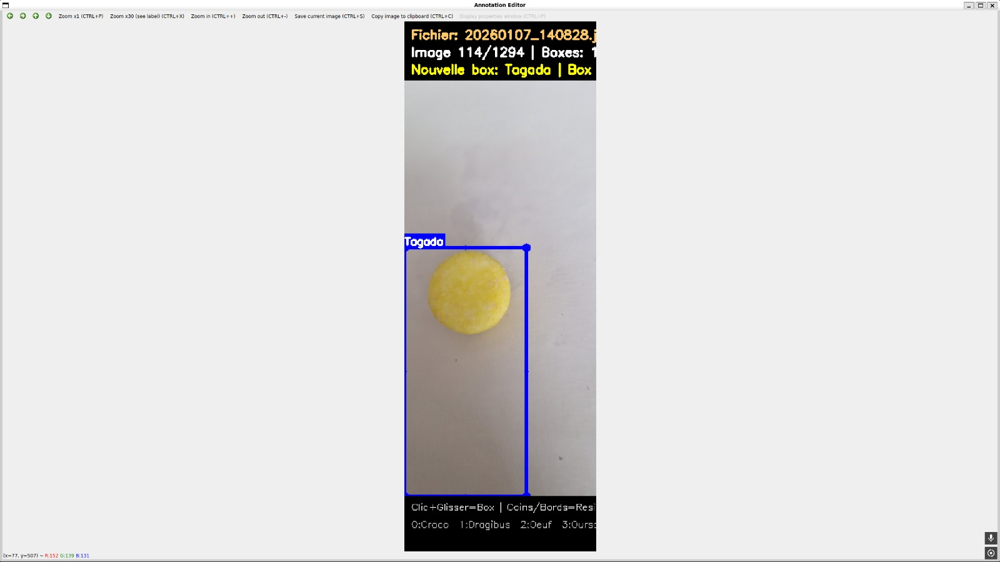
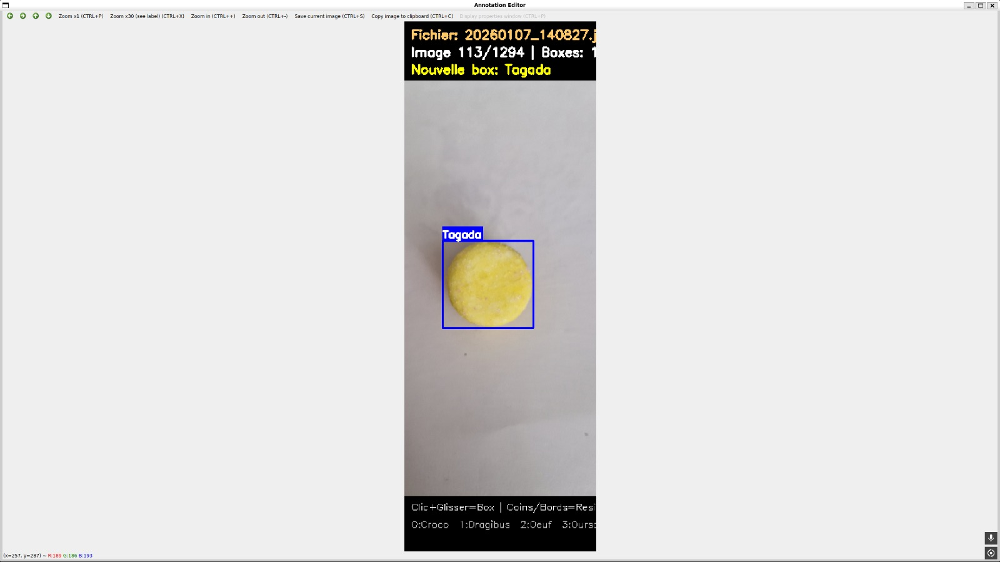

- 19 janvier 2026 - <u>Détection de couleur</u>
 Côté JAVA, nous pouvons à présent récupérer le carré (coordonnées + taille) d'où ce situe l'objet. Après un travail OpenCV dans [ML_Project_Candy/java_app/src/ColorIdentificator3000.java](ML_Project_Candy/java_app/src/ColorIdentificator3000.java), on peut exporter une image complètement détourée. Il est bien plus facile de détourer l'image maintenant que l'on a zoomer sur l'objet à détourer. 
En ayant une image détourée, on peut tout simplement faire la proportion des couleurs des différents pixels et l'afficher à l'utilisateur.

---

- 18 janvier 2026
  - <u>Annotation/labellisation</u>
La labellisation contient différentes données : 
Le type de bonbon, qui est une information fourni directement par nos soins lors de l'import. Mais également, ce qui n'était pas effectué auparavant, c'est la position et la taille de l'objet sur l'image.

Ce travail a été fait en partie par un programme développé en JAVA ([ML_Project_Candy/java_app/src/CandyDetectorApp.java](ML_Project_Candy/java_app/src/CandyDetectorApp.java)). Puis toutes les images annotés sont repassés en revue par un humain (Rémi Courty ! ).

*Image mal annotée*

*Image bien annotée après correction*

  - <u>Export du modèle avec le format ONNX</u>
 Maintenant que le modèle est entrainer sur Python, il faut assurer une bon transfert entre Python et JAVA. Cela c'est fait en choisisant le format universel et utilisable par OpenCV ONNX.

---
- 15 janvier 2026 - <u>Grand changement d'IA</u>
   A la vue des résultats médiocres et de l'utilisation du reste de la classe d'autres IA, nous avons décidés de passer sur du **deep learning**.
  C'est donc grâces à des réseaux de neuronnes que nous allons créer un modèle. 

  Nous utiisons donc **YOLO**, une bibliothèque sous Python dans le but de créer un modèle robuste. 

  La version précédente, utilisant entre autre SMILE, est disponible dans le fichier [ML_Project_Candy/java_app/src/ImageClassifier.java](ML_Project_Candy/java_app/src/ImageClassifier.java).
  Nous utilisation à présent seulement OpenCV pour l'utilsation de notre modèle.

---
- 9 janvier 2026 - <u>Changement des inputs</u>
 Jusqu'à maintenant, le traitement des différentes données était d'analyser pixel par pixel. Mais c'est une technique peu fiable qui ne prend pas en compte différentes spécificités de l'image : les contours, les formes, les motifs...

C'est pour cela que de nouvelles technologies sont intégrés à l'application. On y trouve des technnologies optimisées pour le traitement d'images : 
  - Histogram of Oriented Gradients (HOG) : au lieu de prendre un pixel en entré, on va prendre le résultat d'une transformation mathématique qui explicite les contous et la forme des objets présents sur une image

  - Support Vector Machines (SVM) : plus partie IA, en plus de changer les données en entrée, on y rajoute un algorithme d'optimisation de la séparation entre les classes. Cela va servir à maximiser la marge entre chaque éléments correpondants aux classes.
Malheureusement les résultats sont peu concluents car de nombreux paramètres sont à prendre en compte.

---
- 8 janvier 2026 - <u>Utilisation Git LFS</u>
Nous utilisons à présent Git LFS pour ce partager le lourd dataset. Gestion plus rapide de fichier prenant de la place.
---
- 6 janvier 2026 - <u>Update dataset</u>
 Nous nous sommes rendus compte que la quantité d'informations dans le dataset impact beaucoup les résultats. Ajout supplémentaire des plusieurs photos de bonbons (x10)
---

- 29 décembre 2025 - <u>OpenCV problème</u>
 Le choix avait été fait de garder toutes les bibliothèques en interne au programme. Les différences de versions entre OpenCV et ces dépendances avait causés plusieurs disfonctionnements.
---

- 24 octobre 2025 - <u>Programme IA fonctionnel</u>
  - <u>Détection de bonbons</u>
A ce moment, c'est le machine Learning qui a été retenu pour faire ce projet, excluat tout réseau de neuronnes. Grâce aux *arbres à choix*, le programmes en utiisant le modèle créé arrive à détecter les bons bonbons sur plusieurs images. [Détection de 4/6 images de test]

  - <u>Modification ColorIdentificator</u>
Conversrion en niveau de gris, implémentation de l'algorithme de Canny

---
- 20 octobre 2025
  - <u>Création du dataset</u>
Prise de photographies sur plusieurs bonbons. Une vingtaine d'exemplaires pour chque bonbons
  - <u>Détection de couleur</u>
Premiers essais de traitement logiciel (sans IA) pour la détection de couleur avec OpenCV. Problème de détection des contours.
---

- 7 octobre 2025 - <u>Début du projet</u>
Compréhension du sujet et premières recherches sur les bibliothèques IA, disponibles sur JAVA. 
Orientation vers la bibliothèque open-source Smile, découverte de OpenCV (traitement d'images)

 

*Rédigé à partir de l'avancé GIT sur le projet Github*