Le principal type d'intelligence articielle utilisé ici est l'apprentisage profond (**deep learning**). Celui-ci utilise des réseaux de neuronnaux afin de créer un modèle "inteligent".

De quoi part-on pour faire notre modèle qui reconnaitra n'importe quel bonbon ?
Dans notre cas nous allons lui fournir beaucoup d'images qui seront labellisé. Labellisé veut dire que durant la phase d'entrainemen, on communique le type de bonbon que l'on traite.

### Pre - processing 

> La plupart du temps, il est nécessaire de passer par l'étape du pré-processus avant de founir des données à l'application qui réalisera le traitement neuronnal.

Qu'es ce qu'une image numériquement ? 
Ce sont un ensemble de pixels qui contiennent trois informations : 3 valeurs de 0 à 255 pour R, G et B. 

Il faut tout d'abord s'assurer que chaque image analysée possède le même nombre d'information. C'est le **redimensionnement** de la taille des images. Avec l'aide de OpenCV, il faut redimensionner en respectant le ratio original les différentes images avec une résolution fixe. Pour respecter le ratio, il faut parfois faire du *padding* : rajouter des pixels pour faire l'image.
*C'est un paramètre que l'on définit. Théoriquement, une plus grande résolution*

 YOLO convertit ces valeurs entre 0.0 et 1.0. Cette partie s'appelle la **normalisation**. Ces données pourront mieux être analysées par le code. 

Ensuite, le deep learning se base sur des apprentissages successifs. En effet, après être passé une première fois dans le modèle, il faut vérifier si l'algorithme fonctionne bien et sinon il faut regarder qu'es ce qui n'a pas fonctionné. C'est pour cela que l'on va **diviser** l'ensemble des données. Une division courante est de 70 % pour l'entraînement, 20 % pour la validation et 10 % pour les tests. Cette étape est à adapter si l'on se retrouve avec des classes (catégories) déséquilibrées.

Enfin, nous avons la notion d'**augmentation des données**. A partir des images présentes dans le dataset, le soft. va recréer de nouvelles images aditionneles en changeant différents paramètres.

### Algorithme IA dans YOLO

Mis à part de nombreux autres pré-traitements qui ont lieu directement durant le processus, YOLOv5 (v6.0/6.1) est un algorithme mettant en oeuvre un processus similaire à *Inception*, une architecture spécifique de réseau de neuronnes.

On ne pas rentrer dans le détail qui est très complexe mais on peut aborder les points clés. En fait, le travail sur une image va se faire à différentes échelles. 

Un point important est le fait d'avoir une "structure parcimonieuse". Au lieu d'avoir un énorme bloc de calcul uniforme, le module Inception fragmente le travail en petites tâches spécialisées.
Dans cette architecture, on retrouve 22 couches qui partent de la donnée brute jusqu'à sortir une information. Il y a 4 types de couches que l'on va rencontrer : 

- Couche **convolution** : sur de petites zones d'images, elle va détecter des motifs (bords, textures, couleur)
- Couche de **Pooling** : celle-ci va garder les informations les plus importantes pour réduire les calculs nécessaire et supprimer les informations inutiles (l'emplacement de l'image).
- Couche **Inception** : à cet étape, la couche va sélectionner une partie de l'image à plusieurs échelles ce qui aura pour effet d'apprendre à quel échelle faut-il analyser l'image.
- Couche **"Fully Connected"** : la couche finale qui prend toutes les caractéristiques en considération.

L'architecture est optimisée pour ne pas demander trop de ressources, incluant un nombre réduit par rapport à d'autres de paramètres.

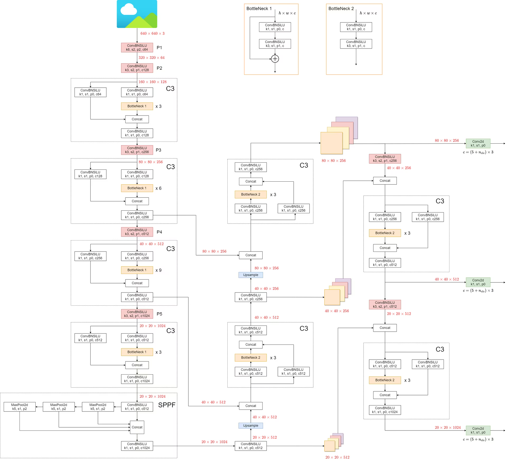
*Voici ci-dessus le synopsys de YOLO*

La structure est tellement complexe qu'on ne voit pas où est concrètement les réseaux de neuronnes. 

Dans ce type de réseaux de neuronnes, il peut être intéressant d'aller voir les illustrations sur le site internet suivant. Cela montre bien l'interraction entre les différentes couches.

- https://poloclub.github.io/cnn-explainer/?hl=fr-FR

Voir aussi section *Résultats* de ce document pour voir les réarangement des images.

### Paramètres

#### Paramètres entraînement 

Au moment de lancé l'entrainement, on va pouvoir jouer sur un nombre d'éléments, ce qui va avoir pour effet de changer différentes choses pendant l'entrainement. Voir [ML_Project_Candy/python_training/scripts/train_yolov8_candy.py](ML_Project_Candy/python_training/scripts/train_yolov8_candy.py).

`results = model.train(`
    `data='candy.yaml',           # Dataset cconfig

    `epochs=epochs,               # Nombre d'époques (défaut: 100) (paramètres performance GPU)`
    
    `imgsz=img_size,             # Taille images (défaut: 640)(résolution des images en entrée) `   
     
    `batch=16,   # ← Taille batch`
    
    `patience=30,                 # ← Early stopping`
    
    `save_period=10,              # ← Sauvegarde tous les X epochs`
    
    `cache=True,                  # ← Cache dataset en RAM`
    
    `workers=1,                   # ← Threads chargement`
    
    `verbose=True,`
    
    `val=True`
    
`)`

#### Fichier candy.yaml

Principal levier utilisateur pour intéragir avec l'entrainement du modèle, c'est ici que l'on va rentrer les différents paramètres.
- Fichier: [ML_Project_Candy/python_training/candy.yaml](ML_Project_Candy/python_training/candy.yaml)
- Les catégories 
- Les chemins de fichiers
- Les paramètres d'augmentation 

Ceux-ci peuvent être configurés avec l'aide de la documentation : https://docs.ultralytics.com/fr/guides/model-yaml-config/#parameters-section

## Résultats

> Avec YOLO, on peut exporter plusieurs données clés de notre modèle créé. Voici ci-dessous plusieurs indicateurs montrant les performances de notre modèle créé.
> *Le dernier en date, le V.14.*

### Statistiques

**Matrice de confusions**

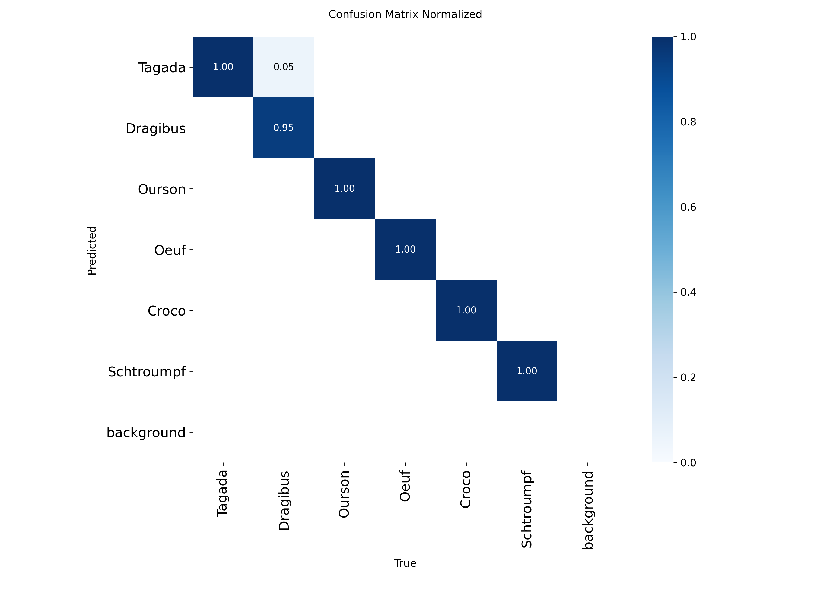
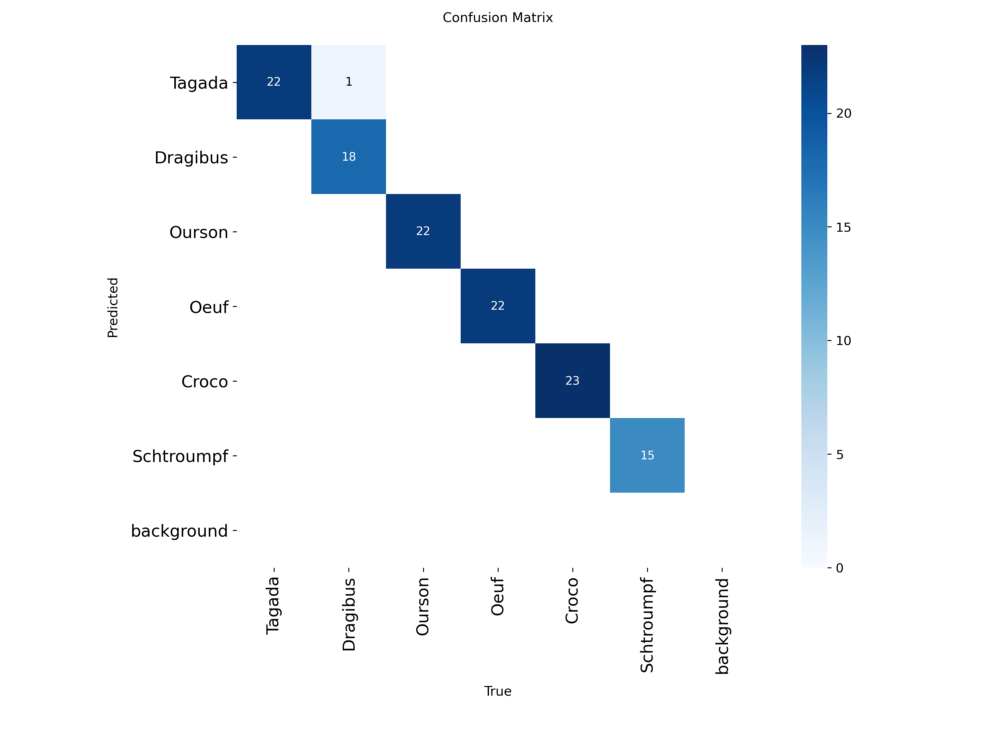
*Ci-dessus, les matrices de confusion (normalisé et non normalisé)*

Ces matrices permettent juste de vérifier la veracité des prédictions. C'est une bonne indication pour voir si les prédictions sont bonnes. On observe une erreur qui va d'ailleurs influencé plusieurs graphiques (un dragibus détecté en tagada).

---

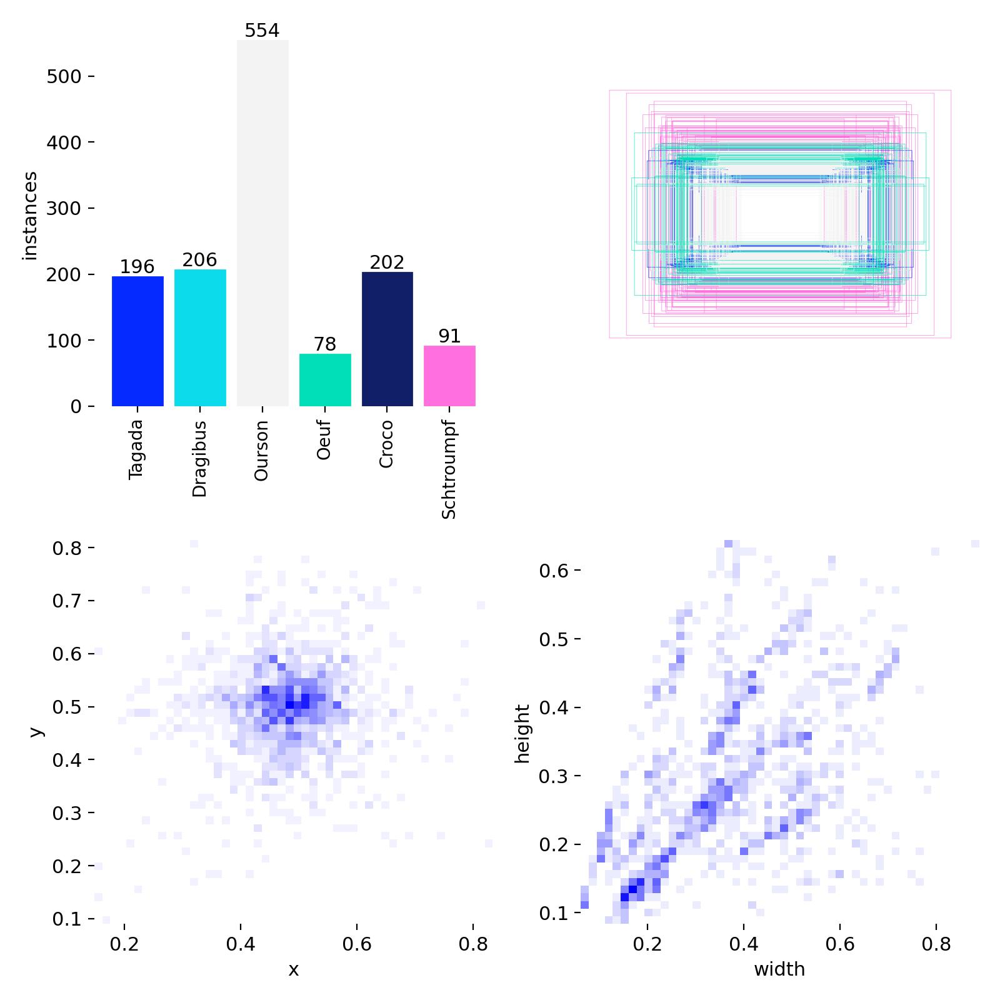
*Répartition des classes / Statistiques des emplacements des images*

Cela donne une information sur la nature des images présentes dans le *dataset*. On y trouve également la représentation des différentes résolutions de ces images. On peut utiliser ce graphique pour retravailler notre dataset.

Une autre utilisation du graphique est l'utilisation explicite de ces données pour commencer à différencier différents ratio de taille d'objet donnant une information sur le type d'objet.

--- 
Voici d'autres courbes ci-dessous illustrant la précision et la confiance du modèle :

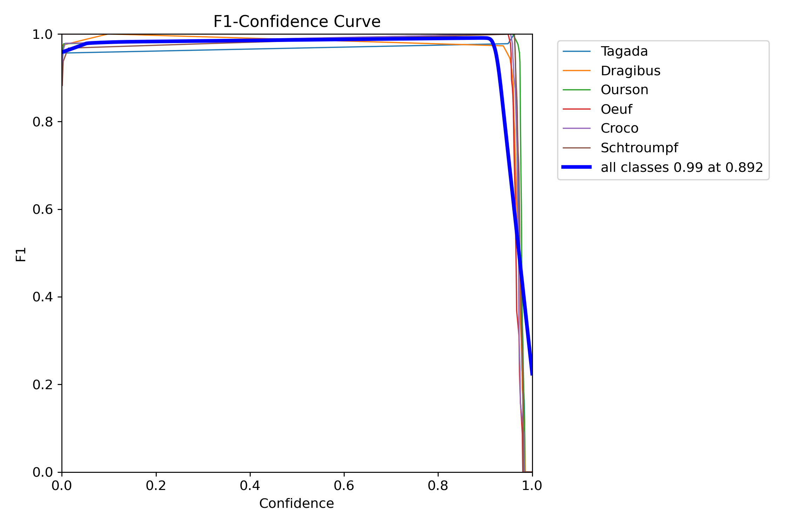

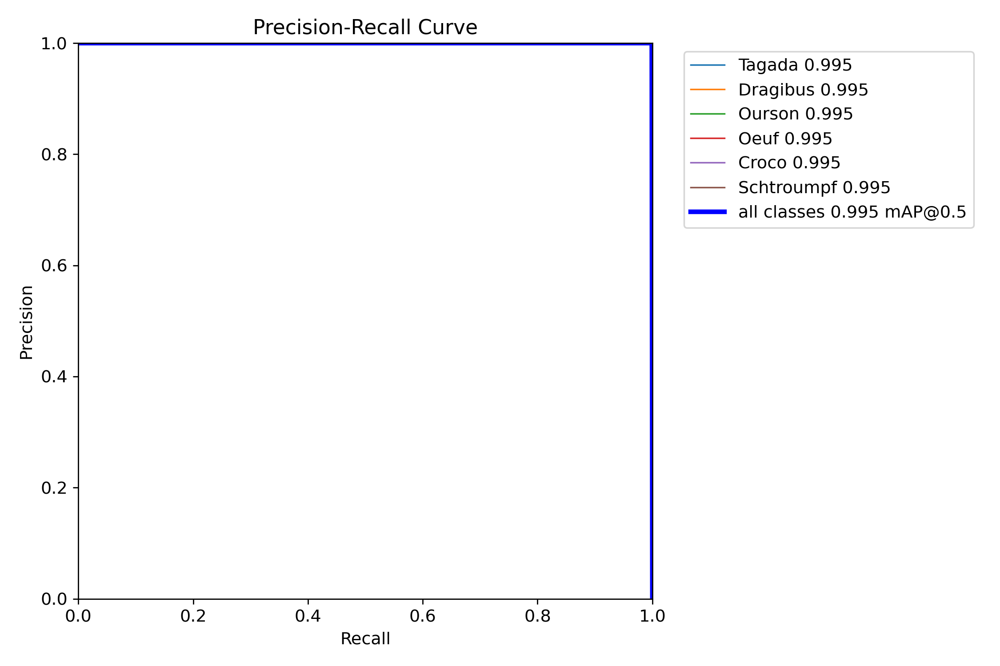

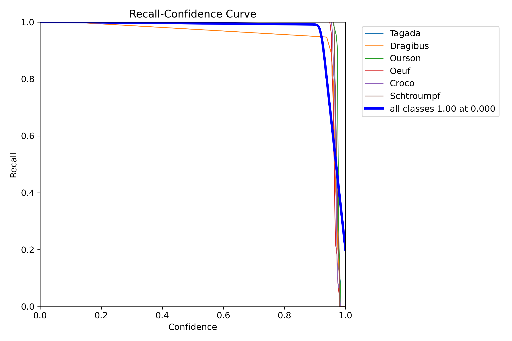

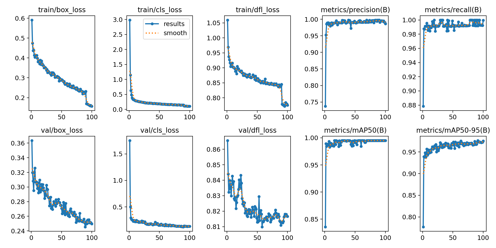

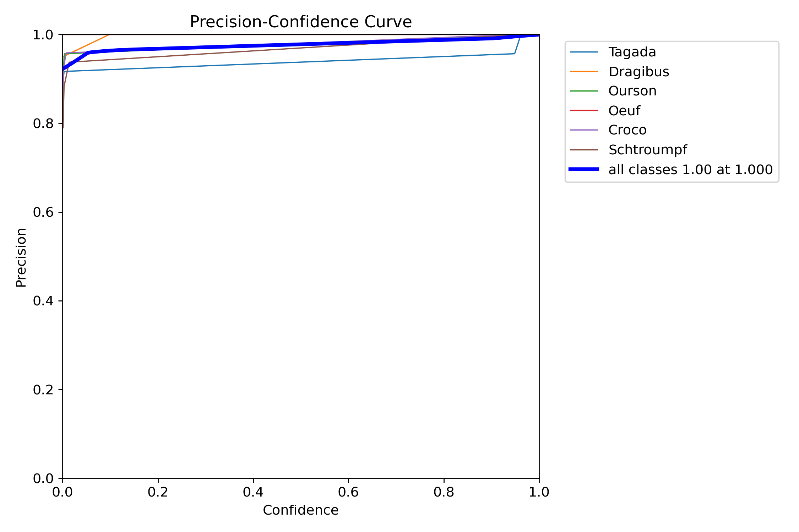

---
### Extraction de la vision d'un modèle PENDANT l'entrainement

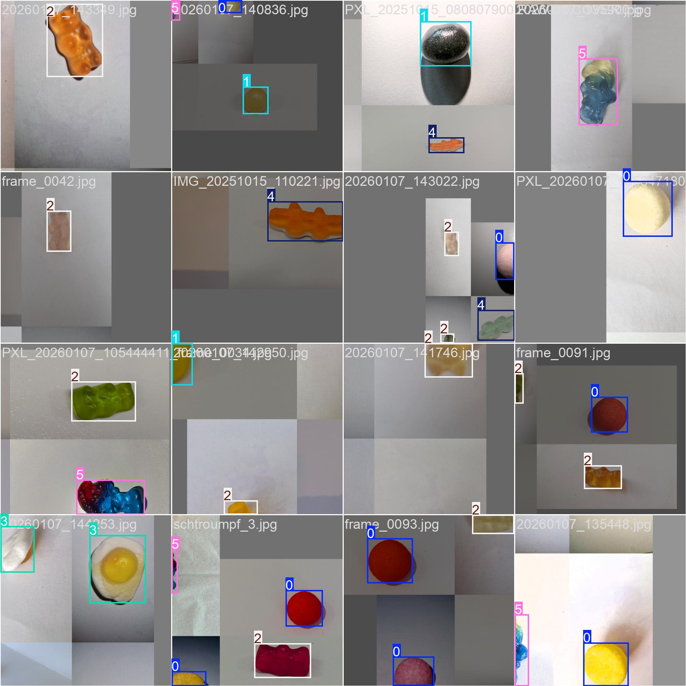

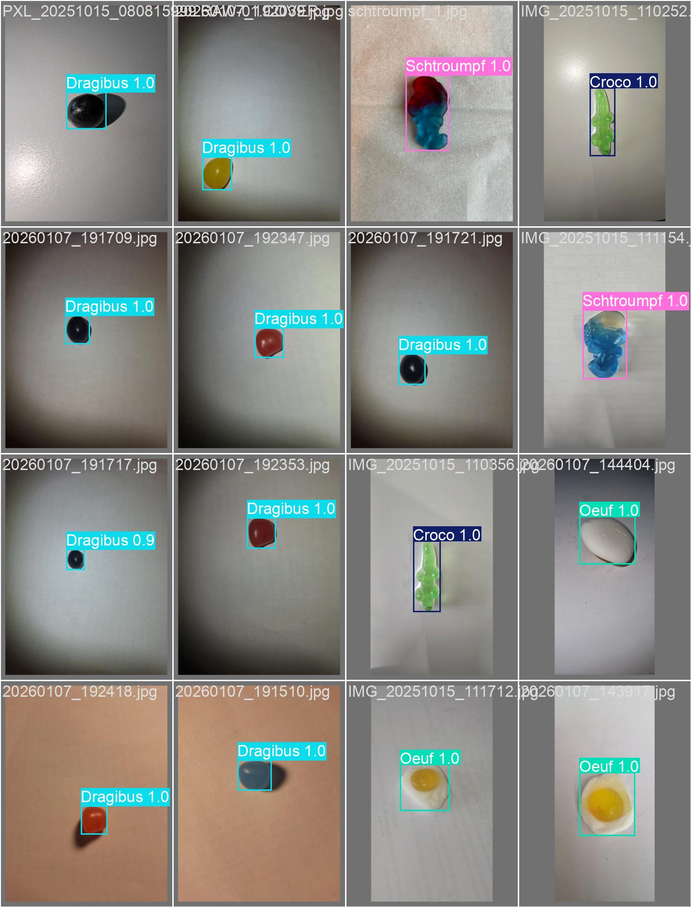
*Détection et prédiction des bonbons PENDANT l'entrainement*

Ce sont des images extraites durant la création du modèle. Etant donné que les images sont classifiées, après avoir fais une prédiction, ils peuvent vérifier si l'algorithme a bel et bien détecté l'objet et sinon adapter l'algorithme.

Dans la première image, cela montre aussi comment les images sont redimensionnées, modifiées, mise côte à côte pour  optimiser l'apprentissage.

## Sources : 

- https://docs.ultralytics.com/guides/preprocessing_annotated_data/#splitting-the-dataset
- https://docs.ultralytics.com/datasets/detect/
- https://docs.ultralytics.com/fr/yolov5/tutorials/architecture_description/
- https://arxiv.org/pdf/1409.4842